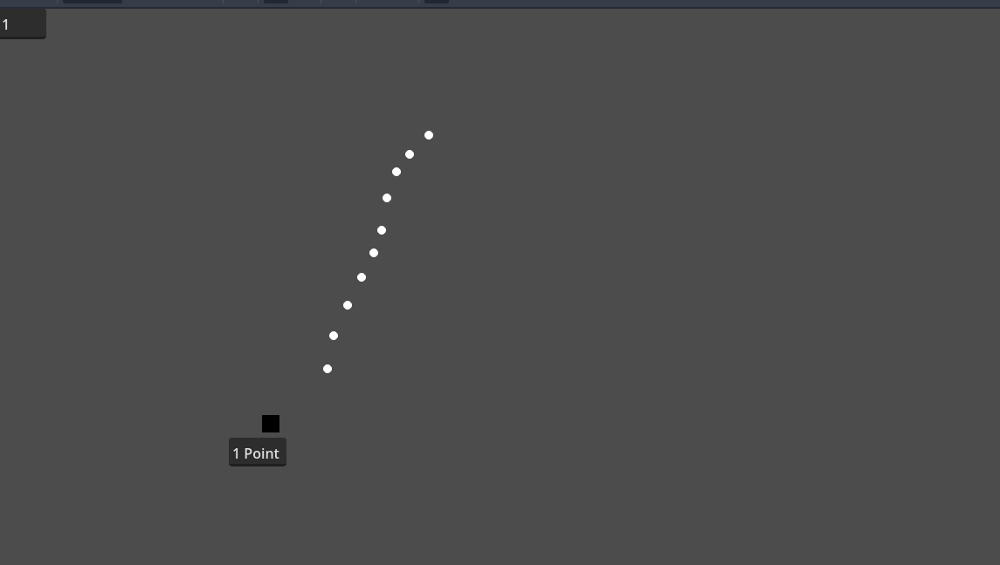

# Introduction to Godot

This repository is a 1 and a half hour introduction to the game engine Godot in english, prepared for students in the IUT in Limoges.
It is also part of an introduction to my research conducted in the XLIM laboratory in the university of Limoges.

In this tutorial we introduce the following Godot concepts:

- Scenes
- Basic Nodes:
    - Physics
    - Sprites
    - GUI elements
- Signals
- Basic scripting
- Input maps

The final result is the minimal required functionality of a pachinko game.

In the top left corner of the image we see a point counter for the game.

## Presentation
You can see the presentation in the following link:
[https://docs.google.com/presentation/d/1u6_EK9ZBalwkHKNXqYdnH0VYlC_I018DJ4wh2h21tMw/edit?usp=sharing](https://docs.google.com/presentation/d/1u6_EK9ZBalwkHKNXqYdnH0VYlC_I018DJ4wh2h21tMw/edit?usp=sharing)

## Contributions
All the assets and the tutorial were made by Heinich PORRO.